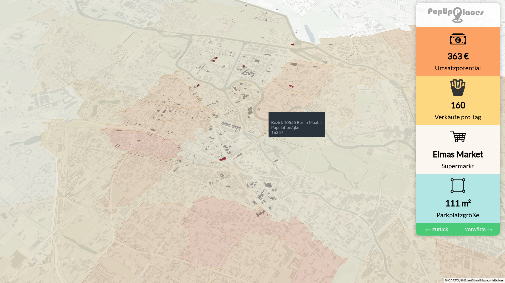
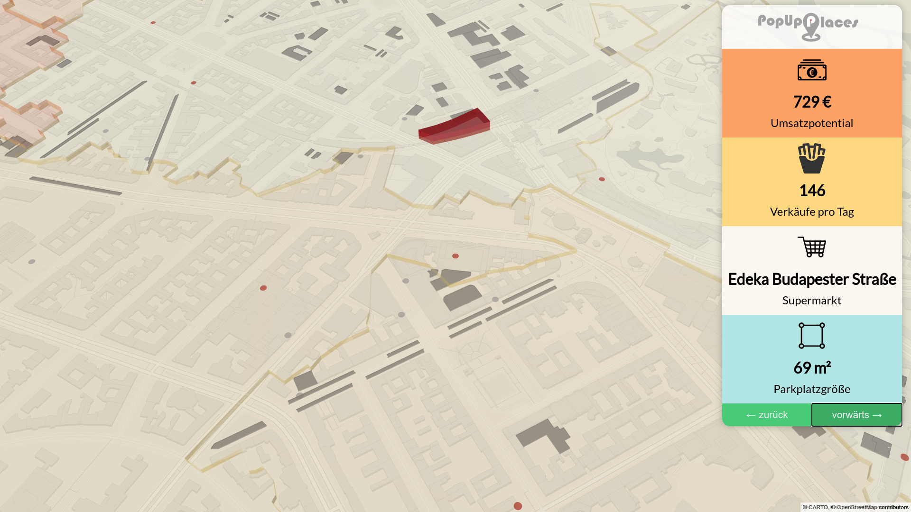
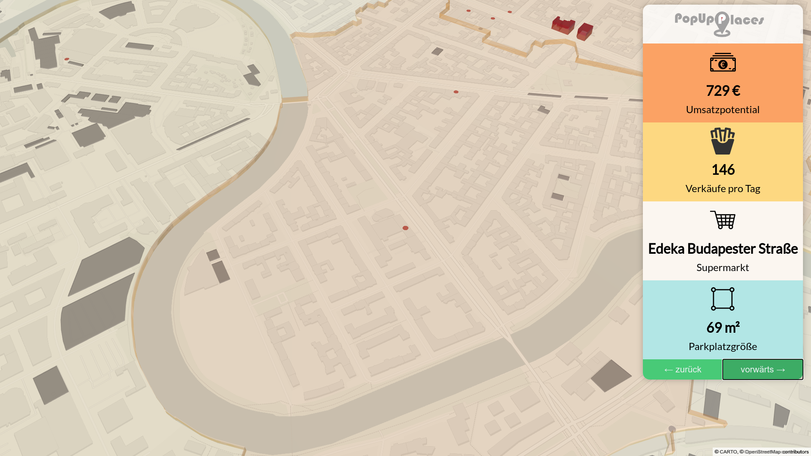
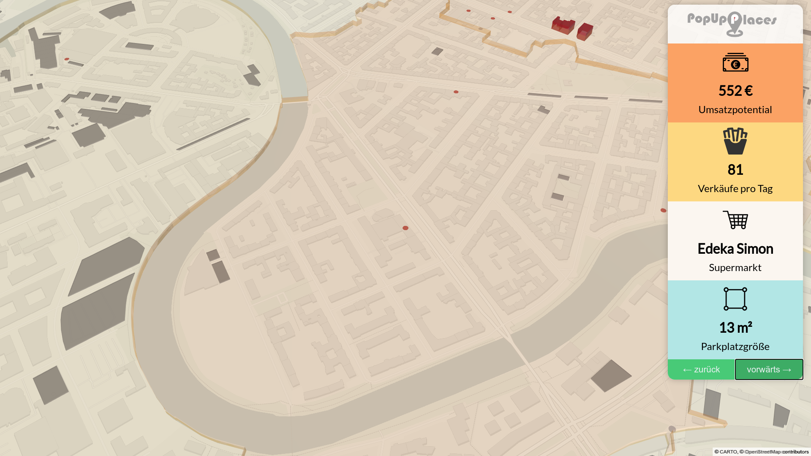

# location-popup-restaurant

This project uses the following data sources and technologies to find a good place for a pop up restaurant on a super market parking log:

 * [OpenStreetMap Data for Streets, Supermarkets and Parking Lots](https://www.openstreetmap.org/)
 * [Overpass API to read specific data from OpenStreetMap](https://overpass-turbo.eu/)
 * [MapBox GL to render a map from vector tiles](https://docs.mapbox.com/mapbox-gl-js/api/)
 * [Carto to read free non commercial vector tiles and style the map](https://carto.com/basemaps/)
 * [Tensoflow JS for an SGD Optimizer](https://js.tensorflow.org/api/latest/#train.sgd)
 * [Deck.gl for 3D visualization](https://deck.gl/)

[Demo](https://manuelb.github.io/location-popup-restaurant/)

# Screenshots

 * 
 * 
 * 
 * 